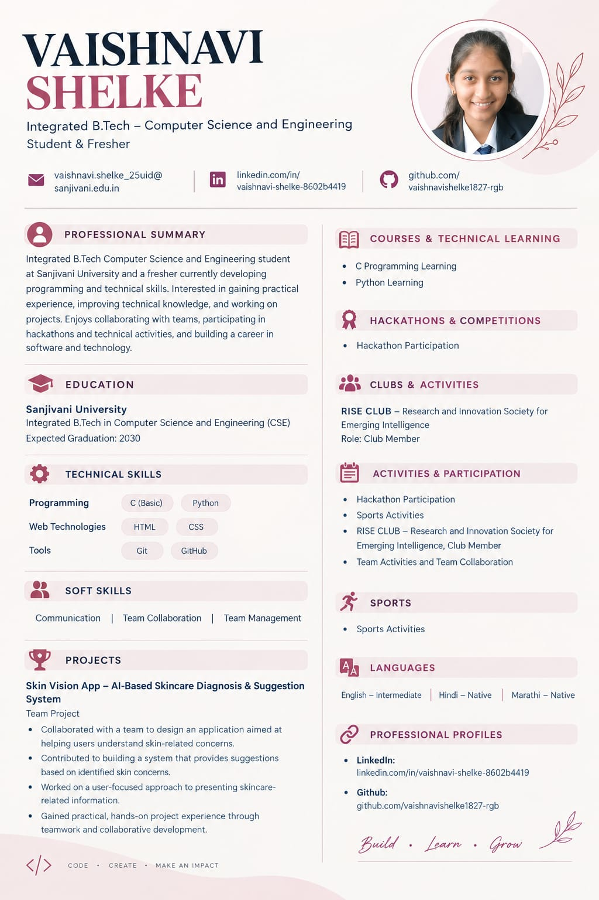

# Vaishnavi Shelke — Portfolio

A single-page personal portfolio for **Vaishnavi Shelke**, Integrated B.Tech Computer Science & Engineering student at Sanjivani University. Built with HTML, Tailwind CSS (CDN), and vanilla JavaScript — no build step required.

🔗 **Live demo:** _add your GitHub Pages link here after deploying (see below)_

## Preview



## Features

- Responsive hero section with animated background blobs and a marquee banner
- Academic journey timeline (Education & Milestones)
- Skills section with a live search/filter box
- Project cards with category filtering (All / AI-Security / Web) and detail modals
- Research & publications spotlight card with a "Copy citation" button
- Contact section with a message form, click-to-copy email, and a direct WhatsApp link
- **One-click Resume download** — the "Resume" / "Download CV" buttons in the navbar, hero, and mobile menu download `assets/Vaishnavi_Shelke_Resume.pdf` directly (no modal, no extra click)

## Project Structure

```
.
├── index.html                          # The entire site (markup + Tailwind config + JS)
├── assets/
│   ├── Vaishnavi_Shelke_Resume.pdf     # Downloadable resume (served by the Resume/CV buttons)
│   ├── profile-photo.jpg               # Hero avatar photo
│   └── resume-preview.jpg              # Full resume image, used above and for reference
└── README.md
```

## Tech Stack

- **HTML5**
- **Tailwind CSS** via the CDN play script (`cdn.tailwindcss.com`) — no `npm install` needed
- **Lucide Icons** via CDN
- **Google Fonts** — Space Grotesk, IBM Plex Sans/Mono, Playfair Display, Outfit
- Vanilla **JavaScript** for the mobile menu, skill/project filtering, project modals, and copy/toast helpers

## Running Locally

No build tools or dependencies are required — it's a static site.

1. Clone the repo:
   ```bash
   git clone https://github.com/<your-username>/<repo-name>.git
   cd <repo-name>
   ```
2. Open `index.html` directly in your browser, **or** serve it locally so relative asset paths behave exactly like production:
   ```bash
   python3 -m http.server 8000
   # then visit http://localhost:8000
   ```

## Deploying to GitHub Pages

1. Push this repository to GitHub.
2. Go to **Settings → Pages** in your repo.
3. Under "Build and deployment", set **Source** to `Deploy from a branch`.
4. Choose the `main` branch and `/ (root)` folder, then **Save**.
5. Your site will be published at `https://<your-username>.github.io/<repo-name>/` within a minute or two.
6. Come back and drop that link into the "Live demo" line at the top of this README.

## Updating the Resume

Swap in a new PDF at any time — just keep the same filename so the buttons keep working:

```bash
cp /path/to/your/new-resume.pdf assets/Vaishnavi_Shelke_Resume.pdf
```

If you rename the file, update the three `href="assets/Vaishnavi_Shelke_Resume.pdf"` references inside `index.html` (navbar, hero "Download CV" button, and the mobile menu) to match.

## Customizing

- **Colors & fonts** — edit the `tailwind.config` block near the top of `index.html` (`paper`, `ink`, `rose`, `lavender`, `gold`, `sanjivani` color tokens).
- **Content** — all copy (About, Education, Skills, Projects, Research, Contact) lives directly in the corresponding `<section>` in `index.html`.
- **Projects** — each card's modal content is defined in the `projectDetails` object near the bottom of the `<script>` tag.
- **Contact form** — currently shows a success toast on submit but doesn't send anywhere. Wire it up to a service like Formspree, EmailJS, or your own backend endpoint to actually receive messages.

## Contact

- 📧 shelke.vaishnavi@sanjivani.edu.in
- 💬 [WhatsApp](https://wa.me/917720930334)
- 🐙 [GitHub](https://github.com/vaishnavishelke73)
- 💼 [LinkedIn](https://linkedin.com/in/vaishnavi-shelke-8602b4419)

---

_Designed & built for Vaishnavi Shelke — CSE, Sanjivani University._
